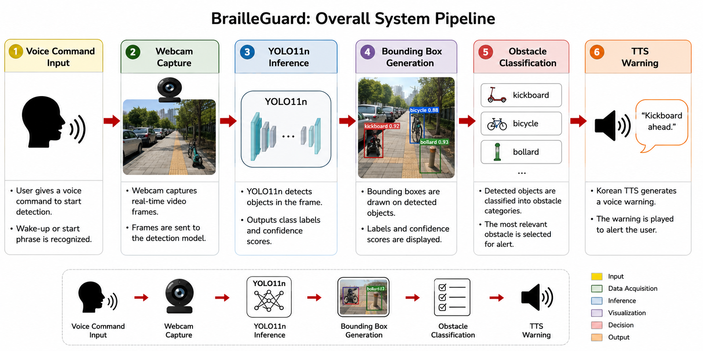
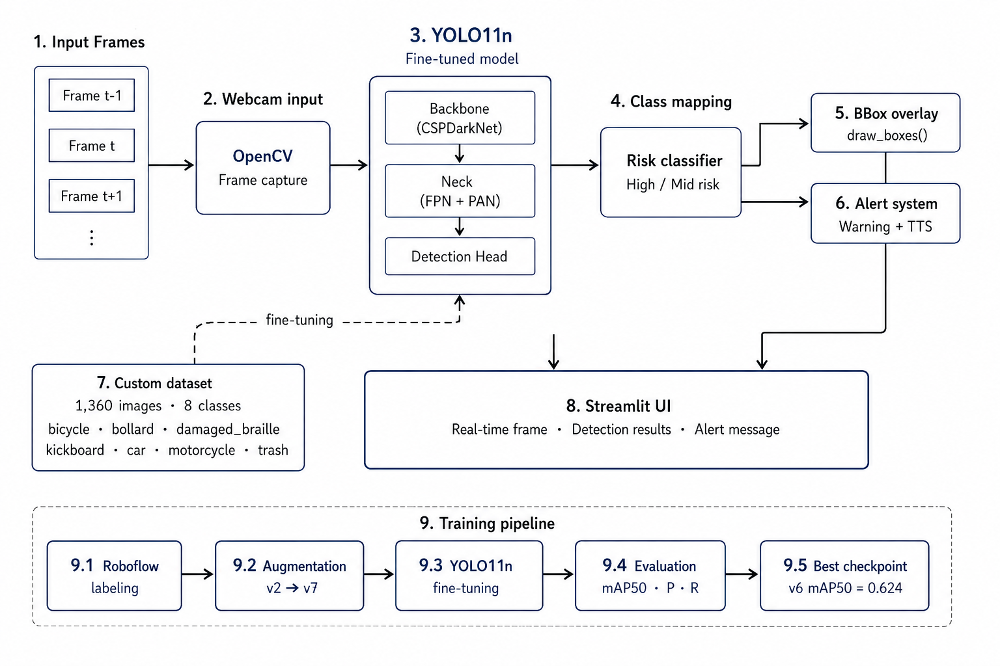
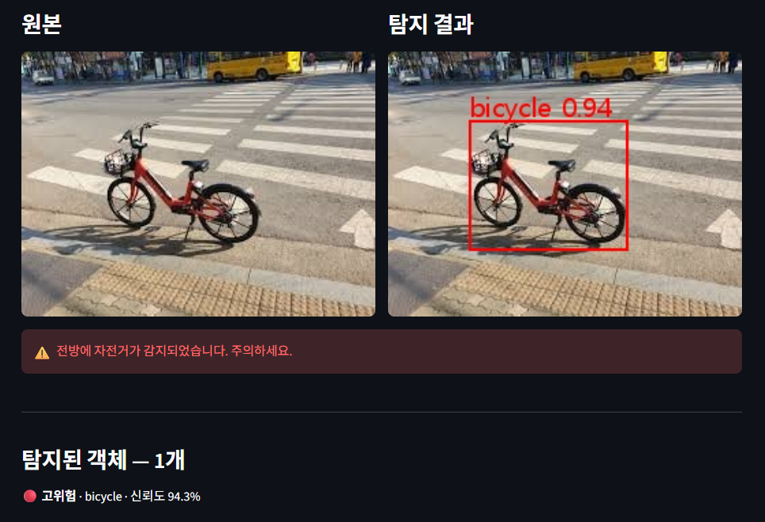
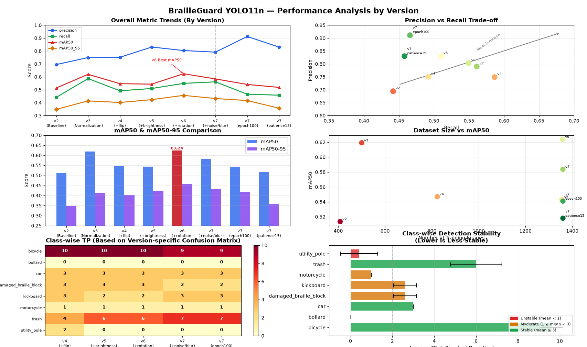

# BrailleGuard: Real-Time Obstacle Detection System for Visually Impaired Pedestrians

#### Yeji Kim, Jihyun Park, Hyunhee Shim

Sookmyung Women's University, Seoul, Republic of Korea

---

#### This repository is the official implementation of BrailleGuard, a real-time obstacle detection system for visually impaired pedestrians using YOLO11n.

---

## Summary

#### Abstract
> _BrailleGuard is a real-time vision-based obstacle detection system designed to assist visually impaired pedestrians navigating sidewalks. Using a fine-tuned YOLO11n model trained on a custom Korean sidewalk dataset, the system detects hazardous objects such as kickboards, bicycles, bollards, and damaged braille blocks through a smartphone or webcam. Upon detection, the system provides immediate audio alerts and Korean TTS guidance to warn users of potential dangers. The dataset was collected and labeled using Roboflow, with multiple data augmentation strategies including flip, brightness adjustment, rotation, noise, and motion blur applied across training versions (v2–v7). Experimental results demonstrate that v6 (flip + brightness + rotation) achieves the best mAP50 of 0.624, outperforming models trained with additional noise and motion blur augmentation._

#### Network Architecture

<p align="center">
  
</p>
<p align="center">
  
</p>

#### Detection Example

<p align="center">
  
</p>

#### Performance Analysis

<p align="center">
  
</p>

---

## Getting Started

#### Dependencies and Installation

- Python >= 3.10
- YOLO11n (Ultralytics)

```bash
git clone https://github.com/apffkxhsls/OSS-Blind-Walk-Assistant.git
cd OSS-Blind-Walk-Assistant
pip install -r requirements.txt
```

#### Model Weights

Trained model weights are not included in this repository due to file size.
Please download from the link below and place in `models/checkpoints/`.

[](https://github.com/apffkxhsls/OSS-Blind-Walk-Assistant/releases)

models/checkpoints/v7_best.pt   ← place here

---

## Dataset

Custom dataset collected and labeled for Korean sidewalk environments using [Roboflow](https://roboflow.com/).

| Version | Images | Classes | Augmentation |
|---|---|---|---|
| v2 | 408 | 10 | None |
| v3 | 500 | 8 | None (class cleanup) |
| v4 | 823 | 8 | Flip |
| v5 | 1355 | 8 | Flip + Brightness |
| v6 | 1359 | 8 | Flip + Brightness + Rotation |
| v7 | 1360 | 8 | Flip + Brightness + Rotation + Noise + MotionBlur |

#### Class List
- bicycle
- bollard
- car
- damaged_braille_block
- kickboard
- motorcycle
- trash
- utility_pole
- (fire_hydrant)
- (traffic_cone)
---

## Training

Training notebooks are available in `models/notebooks/`.

### Common Training Settings

- Model: YOLO11n
- Epochs: 50
- Image Size: 640
- Batch Size: 8

Dataset configuration is defined in `data.yaml`.

---

## Inference & Demo

```bash
make run
# or
streamlit run src/app.py
```

Three input modes are supported:

- 📷 **실시간 웹캠** — Real-time webcam detection with audio alert
- 🖼️ **이미지 업로드** — Single image upload and detection
- 🗂️ **테스트 이미지** — Test with sample images in `assets/test_images/`

---

## Performance

| Version | Precision | Recall | mAP50 | mAP50-95 |
|---|---|---|---|---|
| v2 (Baseline) | 0.695 | 0.441 | 0.514 | 0.348 |
| v3 (Normalization) | 0.749 | 0.556 | 0.619 | 0.414 |
| v4 (+Flip) | 0.751 | 0.492 | 0.547 | 0.401 |
| v5 (+Brightness) | 0.830 | 0.510 | 0.543 | 0.423 |
| v6 (+Rotation) | 0.803 | 0.549 | 0.624 | 0.456 |
| **v7 (+Noise/MotionBlur)** | **0.791** | **0.561** | **0.584** | **0.432** |
| v7 (Epoch100) | 0.912 | 0.466 | 0.541 | 0.416 |
| v7 (Patience15) | 0.830 | 0.458 | 0.518 | 0.357 |

---

## Project Structure

```text
braille-blind-cv-project/
├── .github/
│   └── workflows/
│       └── ci.yml
├── assets/
│   ├── images/
│   └── sounds/
│       └── warning.mp3       ← Reference TTS alert sound
├── models/
│   ├── checkpoints/          ← [User Action Required] Place downloaded 'v7_best.pt' here
│   ├── notebooks/
│   │   └── BlindWalk_YOLO_Training_v2_to_v7.ipynb
│   ├── training_results/
│   │   └── v2_IrregularDatasetSize ~ v7_augmented_results/
│   └── analyze.py            ← Performance analysis & plotting script
├── src/
│   ├── detection/
│   │   └── detector.py       ← YOLO inference wrapper
│   ├── ui/
│   │   ├── components/
│   │   │   └── bbox_overlay.py
│   │   └── pages/
│   │       └── home.py       ← Main detection tab
│   ├── utils/
│   │   ├── alert.py          ← Sound warning triggers
│   │   └── tts.py            ← Korean guidance announcer
│   └── app.py                ← Streamlit application entrypoint
├── config.py
├── Makefile
├── README.md
└── requirements.txt
```
---

## Role Assignment

| Team Member | Responsibilities |
| :--- | :--- |
| **Yeji Kim** | **Project Lead & Integration Developer**<br>• Integrated YOLO11n model inference with Streamlit real-time UI loop<br>• Managed GitHub branching strategy, repository structure, and collaboration workflow<br>• Oversee overall project schedule, milestones, and deliverables<br>• Conducted comprehensive model performance benchmarking and visualization (v2–v7) |
| **Jihyun Park** | **Data Engineer**<br>• Collected and annotated a custom sidewalk dataset using Roboflow<br>• Managed dataset versioning (v2–v7), class refinement, and data augmentation<br>• Prepared augmented datasets for model training |
| **Hyunhee Shim** | **AI Model Developer**<br>• Fine-tuned YOLO11n on the custom sidewalk dataset<br>• Managed YOLO11n training workflows, checkpoints, and model artifacts |

---

## Acknowledgement

This project builds upon and utilizes the following incredible open-source libraries and platforms:

* [Ultralytics YOLO](https://github.com/ultralytics/ultralytics) — Used for core real-time object detection and model inference.
* [gTTS (Google Text-to-Speech)](https://github.com/pndurette/gTTS) — Used for generating Korean voice alerts and pedestrian guidance.
* [Roboflow](https://universe.roboflow.com/s-workspace-1cqyr/oss-blind-walk-assistant/dataset/2) — Used for custom sidewalk dataset hosting, annotation, and multi-version data augmentation pipelines.

---

## License

This project is licensed under the MIT License - see the [LICENSE](LICENSE) file for details.
